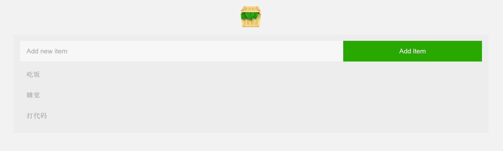

# Node.js Todo List Application

> Declare: This APP is originnally from video ["Node JS Tutorial for Beginners"][link1] in Youtube, written by The Net Ninja, modified by me.



## Functions

1. Add Todo
2. Remove Todo

## Dependencies

1. express
2. ejs
3. body-parser

## Use

1. install

```
git clone https://github.com/baooab/nodejs-todo-app.git

npm install
```

2. run

```
node index
```

Then open browser, enter http://localhost:3000.

[link1]: https://www.youtube.com/watch?v=edOmvng5IQc&index=31&list=PL4cUxeGkcC9gcy9lrvMJ75z9maRw4byYp
